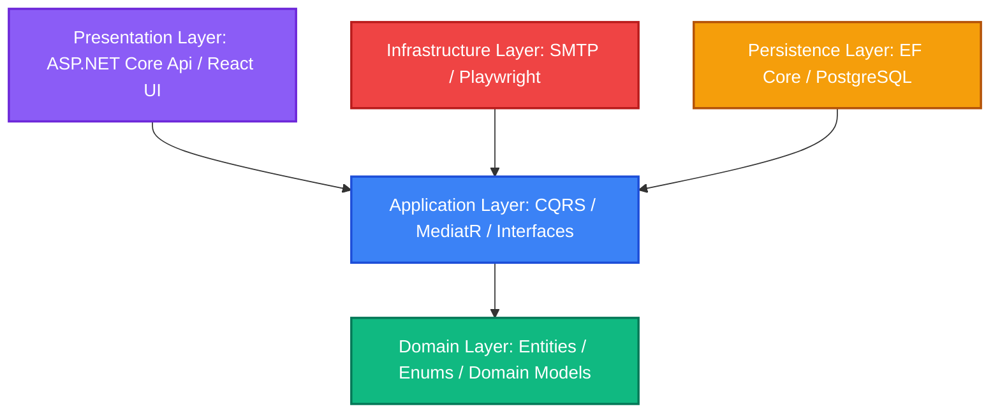

<div align="center">
  

  <br/>
  <br/>

  **Enterprise-ready web crawling and structured metadata extraction platform.**

  [](https://dotnet.microsoft.com/)
  [](https://reactjs.org/)
  [](https://www.typescriptlang.org/)
  [](https://www.postgresql.org/)
  [](https://www.docker.com/)

</div>

---

## 📖 Overview

**CrawlScope** is a modern, enterprise-grade Web Crawler & Content Aggregator designed to automate the collection, structured parsing, and storage of publicly available web content. Built to support robust high-throughput requirements, CrawlScope allows developers and researchers to schedule crawler jobs, monitor execution logs in real-time, inspect extracted page properties (titles, internal/external links, and text content), and download compiled datasets.

Engineered using **Clean Architecture**, **Domain-Driven Design (DDD)**, and **CQRS**, CrawlScope offers clean code, 100% compliant specifications, and zero-downtime background execution.

---

## 📋 Project Specifications Compliance

CrawlScope is **100% compliant** with all mandatory Code Academy requirements for Project 10 (Web Crawler & Content Aggregator):

| ID | Required Feature | CrawlScope Implementation Details | Status |
|---|---|---|---|
| **F1** | **Crawl Job Creation** | Interactive inputs for Target URL, Crawl Depth, Max Pages, and Domain restriction settings (Restricted vs. External scoping). | **Completed** |
| **F2** | **HTTP Page Fetching & HTML Parsing** | Dual-mode crawling: standard HTTP Client fetcher + **Playwright-driven** headless browser crawler to bypass rate-limits/bot checks and extract titles, links, and text. | **Completed** |
| **F3** | **Crawled Data Storage** | Persistent DB schemas saving the source URL, crawl timestamp, HTTP status codes, response times, and full text content snapshots. | **Completed** |
| **F4** | **Crawl Scheduling** | Manual job invocation via UI/API + scheduled, periodic execution powered by a robust background worker. | **Completed** |
| **F5** | **Dashboard & Filtration** | Real-time interactive UI to browse indexing jobs and scraped page snapshots, featuring fast server-side query search and status filtration. | **Completed** |
| **F6** | **Duplicate URL Detection** | Intelligent database/memory hash checks verifying against both pending queue items and already scraped URLs to prevent cycle loops or duplicate processing. | **Completed** |
| **F7** | **Crawl Log transparency** | Individual per-job status logs showing errors, warnings, informational messages, and current pages indexed. | **Completed** |
| **F8** | **Data Export** | Built-in strategies to compile and export harvested datasets instantly to **CSV** or **JSON** formats. | **Completed** |

---

## ⚡ Premium Features

> [!IMPORTANT]
> **Hybrid Crawling Architecture (Fast vs. Dynamic)**
> CrawlScope includes a standard, lightweight HTTP Client-based crawling engine (`Fast` mode) alongside a dynamic JavaScript-rendering engine powered by **Playwright** (`Dynamic` mode). It can crawl client-side rendered Single Page Applications (React, Angular, Vue) effortlessly.

> [!TIP]
> **Smart Fallback Mechanism**
> If a `Fast` crawl receives bot-detection status codes (such as `401 Unauthorized`, `403 Forbidden`, `429 Too Many Requests`, or `503 Service Unavailable`), the system logs a warning and **automatically retries and fails over** to a headless browser (`Dynamic`) session for that URL.

- **🔐 Advanced RBAC (Role-Based Access Control):** Dedicated screens for Admin overview, User profile management, and Role/Permission matrix configurations to secure crawler workloads.
- **📈 Advanced Dashboard Analytics:** Stunning dashboard styling featuring emerald color schemes, glassmorphism, responsive sidebar layout, real-time status counts, and data-density grid layouts.
- **🏗️ Background Queue & Channels:** Utilizing memory-efficient `System.Threading.Channels` for non-blocking asynchronous workload processing.

---

## 🏗️ System Architecture

CrawlScope is developed with strict adherence to **Clean Architecture** principles to separate core domain policies from infrastructural frameworks.



### 📁 Directory Structure
```text
CrawlScope/
├── 📁 backend/CrawlScope/
│   ├── 📁 src/
│   │   ├── 📁 Core/
│   │   │   ├── CrawlScope.Domain/        # Domain entities (CrawlJob, CrawledPage, AppUser)
│   │   │   └── CrawlScope.Application/   # CQRS Handlers, DTOs, Business Rules
│   │   ├── 📁 Infrastructure/
│   │   │   ├── CrawlScope.Infrastructure/# Page Fetchers, SMTP, Identity Services
│   │   │   └── CrawlScope.Persistence/   # DBContext, Configurations, PostgreSQL Migrations
│   │   └── 📁 Presentation/
│   │       └── CrawlScope.Api/           # API endpoints, Swagger, Security Policies
│   │
│   └── 📁 tests/                         # Unit tests (xUnit, FluentAssertions, Mocking)
│
├── 📁 frontend/                          # React 19, Vite, TypeScript, optimized CSS
└── 📄 docker-compose.yml                 # Orchestration setup for PostgreSQL, Api, and UI
```

---

## 🔌 Core API Endpoints

Once the application is running, the interactive Swagger documentation is available at `http://localhost:5000/swagger`.

### 🕷️ Crawling & Job Management
| Endpoint | Method | Description |
|----------|--------|-------------|
| `/api/crawljob` | `POST` | Create a new crawl job (URL, depth, domain restrictions) |
| `/api/crawljob` | `GET` | List all crawl jobs (with pagination and filters) |
| `/api/crawljob/{id}` | `GET` | Get details of a specific crawl job |
| `/api/crawljob/{id}/start` | `POST` | Start the crawl job asynchronously |
| `/api/crawljob/{id}/pages` | `GET` | List crawled pages for the job (search & filter enabled) |
| `/api/crawljob/{id}/logs` | `GET` | Get crawl logs for execution auditing |
| `/api/crawljob/{id}/broken-links` | `GET` | Fetch all discovered broken links for analysis |
| `/api/crawljob/{id}/export` | `GET` | Download crawling data as CSV or JSON |
| `/api/crawlschedule` | `POST` | Schedule recurring crawling tasks (manual/periodic) |

### 🔐 Authentication & Identity
| Endpoint | Method | Description |
|----------|--------|-------------|
| `/api/auth/register` | `POST` | Register a new system account |
| `/api/auth/login` | `POST` | Authenticate and obtain JWT |
| `/api/auth/me` | `GET` | Get profile details of the authenticated session |
| `/api/auth/forgot-password` | `POST` | Request password reset token |
| `/api/auth/reset-password` | `POST` | Set new password securely |

---

## 💻 Getting Started

### Prerequisites
- [Docker & Docker Compose](https://www.docker.com/) (Recommended)
- [.NET 10 SDK](https://dotnet.microsoft.com/)
- [Node.js 20+](https://nodejs.org/) & [pnpm](https://pnpm.io/)

### 🐳 Quick Start with Docker
1. **Clone the repository:**
   ```bash
   git clone https://github.com/mirhuseynma/CrawlScope-WebCrawler.git
   cd CrawlScope-WebCrawler
   ```
2. **Setup environment variables:**
   - Go to `backend/CrawlScope/src/Presentation/CrawlScope.Api`.
   - Rename `appsettings.example.json` to `appsettings.Development.json`.
   - Add your Brevo (SMTP) API key and user verification credentials.
3. **Run using docker-compose:**
   ```bash
   docker-compose up --build -d
   ```
   - **Frontend UI:** `http://localhost:5173`
   - **Backend API:** `http://localhost:5000`
   - **Swagger Doc:** `http://localhost:5000/swagger`

---

## 🧪 Testing

The codebase keeps test coverage high. To run the automated backend test suite:
```bash
cd backend/CrawlScope
dotnet test
```

---

<div align="center">
  <i>Built with ❤️ for robust, scalable data extraction.</i>
</div>
