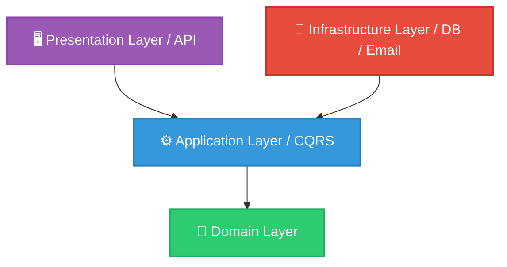

<div align="center">
  

  <br/>
  <br/>

  **A highly scalable, modern web crawling and data extraction platform.**

  [](https://dotnet.microsoft.com/)
  [](https://reactjs.org/)
  [](https://www.typescriptlang.org/)
  [](https://www.postgresql.org/)
  [](https://www.docker.com/)

</div>

---

## 📖 Overview

**CrawlScope** is a robust and highly concurrent web crawler designed for modern data extraction needs. It allows users to efficiently scan websites, extract structural data, and manage the crawling processes through an intuitive, real-time dashboard. 

Engineered with **Clean Architecture** and **Domain-Driven Design (DDD)** principles, CrawlScope ensures long-term maintainability, effortless scaling, and a seamless developer experience.

---

## 🚀 Enterprise-Grade Features

- **🔐 Advanced Authentication:** Secure JWT-based authentication system with Email Confirmation, Password Reset, and secure access policies.
- **🕷️ High-Performance Crawler Engine:** Asynchronous, non-blocking crawling jobs capable of deep-scraping pages, extracting metadata, titles, and links.
- **🛡️ Clean Architecture & CQRS:** Strictly decoupled layers utilizing `MediatR` for Command Query Responsibility Segregation.
- **⚡ Reactive Dashboard:** A lightning-fast, visually stunning frontend built with **React 19 (Vite)** and **TypeScript**.
- **📨 Integrated SMTP Service:** Powered by Brevo (Sendinblue) for reliable system alerts and user verification emails.
- **🐳 Containerized Workloads:** Fully Dockerized ecosystem enabling one-click deployment for databases, backends, and frontends.

---

## 🏗️ System Architecture

CrawlScope is structured using **Clean Architecture** to separate concerns and decouple the core business logic from UI and data access layers.



### 📂 Directory Structure

```text
CrawlScope/
├── 📁 backend/CrawlScope/
│   ├── 📁 src/
│   │   ├── 📁 Core/
│   │   │   ├── CrawlScope.Domain/        # Entities, Enums, Exceptions
│   │   │   └── CrawlScope.Application/   # CQRS, Interfaces, Validators
│   │   ├── 📁 Infrastructure/
│   │   │   ├── CrawlScope.Infrastructure/# External Services (SMTP, Identity)
│   │   │   └── CrawlScope.Persistence/   # EF Core, PostgreSQL Context
│   │   └── 📁 Presentation/
│   │       └── CrawlScope.Api/           # ASP.NET Core API, Controllers
│   └── 📁 tests/                         # Unit & Integration Tests (xUnit, Moq)
│
├── 📁 frontend/                          # React, Vite, Tailwind CSS, TypeScript
└── 📄 docker-compose.yml                 # Multi-container orchestration
```

---

## 🔌 API Endpoints (Core)

The backend provides a rich RESTful API. Once running, explore the full interactive documentation via **Swagger UI** at `http://localhost:5000/swagger`.

### 🕷️ Crawling Engine
| Endpoint | Method | Description |
|----------|--------|-------------|
| `/api/crawljob` | `POST` | Create a new crawling job |
| `/api/crawljob` | `GET` | List all crawling jobs with pagination & filters |
| `/api/crawljob/{id}/start` | `POST` | Start an asynchronous crawling process |
| `/api/crawljob/{id}/pages` | `GET` | Retrieve all successfully scraped pages |
| `/api/crawljob/{id}/broken-links` | `GET` | Analyze and extract broken links |
| `/api/crawljob/{id}/export` | `POST` | Export scraped data (CSV/JSON/Excel) |
| `/api/crawlschedule` | `POST` | Schedule recurring crawling tasks |

### 🔐 Authentication
| Endpoint | Method | Description |
|----------|--------|-------------|
| `/api/auth/register` | `POST` | Register a new user |
| `/api/auth/login` | `POST` | Authenticate and retrieve JWT |
| `/api/auth/me` | `GET` | Get current authenticated user profile |
| `/api/auth/forgot-password`| `POST` | Request a password reset link |
| `/api/auth/reset-password` | `POST` | Set a new password securely |

---

## 💻 Getting Started

### Prerequisites
- [Docker & Docker Compose](https://www.docker.com/) (Recommended)
- [.NET 10 SDK](https://dotnet.microsoft.com/) (For manual setup)
- [Node.js 20+](https://nodejs.org/) (For manual setup)

### 🐳 Quick Start with Docker (Zero-Config)

1. **Clone the repository**
   ```bash
   git clone https://github.com/mirhuseynma/CrawlScope-WebCrawler.git
   cd CrawlScope-WebCrawler
   ```

2. **Setup Environment Variables**
   - Navigate to `backend/CrawlScope/src/Presentation/CrawlScope.Api`.
   - Rename `appsettings.example.json` to `appsettings.Development.json`.
   - Update `SmtpSettings` with your real Brevo credentials. (Database connection is pre-configured for Docker).

3. **Spin up the stack**
   ```bash
   docker-compose up --build -d
   ```
   *The API will be available at `http://localhost:5000` and the Dashboard at `http://localhost:5173`.*

---

## 🧪 Testing

The project maintains a high standard of code quality with robust Unit Tests.
To run the automated tests:
```bash
cd backend/CrawlScope
dotnet test
```

---

<div align="center">
  <i>Built with ❤️ for scalable data extraction.</i>
</div>
